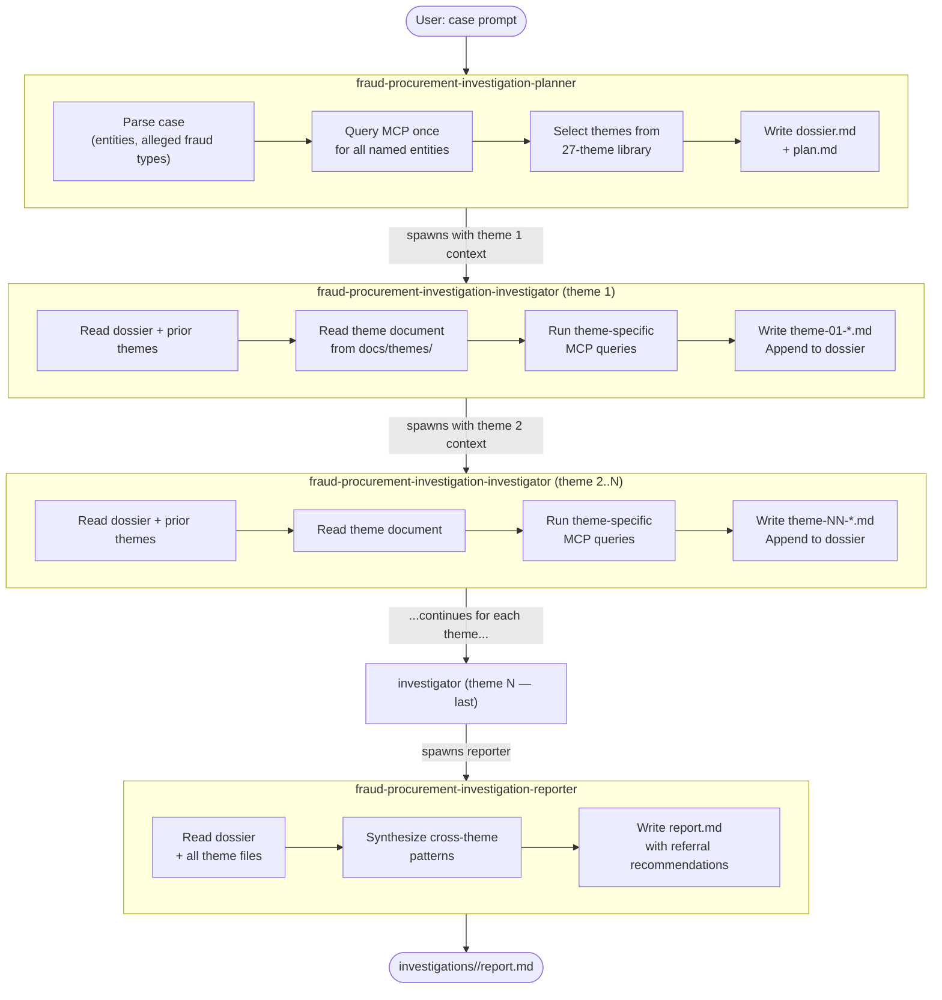

# Tyras — Lithuanian Public Procurement Fraud Investigation Agentic System

A multi-agent Claude Code system for investigating public procurement fraud in Lithuania. Agents query a Viešpirkiai MCP
server that exposes procurement contracts, company registry, court cases, and PINREG declarations, then produce
structured investigation reports with supervisory authority referral recommendations.

---

1. Create Claude account, go to Customize → Connectors → Add custom connector → add `https://viespirkiai.org/mcp`
2. Get Claude Pro plan, install Claude CLI and execute `claude` in the root of this repository.
3. Type `/mcp` to see if the Viešpirkiai MCP server is available.
4. Type `/agents` and select Library → `fraud-procurement-investigation-planner`.
5. Write down an initial investigation query in the prompt, e.g.

```text
Ar gali pereiti per pagrindines institucijas, patikrinti IT paslaugų pirkimo konkursus, pasižiūrėti kas laimėjo kiekvieną etapą ir matant didesnę imtį paieškoti sąsajų.
Vienas iš rizikos veiksnių yra nedidelė techninės specifikacijos paruošimo paslaugų kaina.
Apimtis (Scope) yra sveikatos ministerija ir visos sveikatos ministerijai pavaldžias institucijas.
```

6. Nothing to do next, just watch the agents work! The planner will parse your query, select relevant fraud themes, and
   spawn investigator agents to run MCP queries. Finally, a reporter agent will synthesize the findings into a
   structured report with referral recommendations. Find `report.md` in the `investigations/` folder.

> Usually a single investigation task about 30 minutes and costs one third of your session tokens.

---

## Agent Overview

### `fraud-procurement-investigation-planner`

Bootstraps an investigation from a case prompt. Parses the case, queries MCP once for all named entities (companies
and individuals), selects relevant fraud themes from the 27-theme library, then writes the shared dossier and
investigation plan. Spawns the first investigator agent to begin the theme chain.

**Trigger:** User describes a case — e.g. _"Investigate a 5M EUR municipal road contract awarded to UAB Xyz in 2024;
allegations of bid rigging and conflict of interest."_

---

### `fraud-procurement-investigation-investigator`

Executes one fraud theme per instance. Reads the shared dossier and all prior theme findings, then runs
theme-specific MCP queries (aggregations, document searches, SQL over procurement views). Writes its findings file,
appends a summary to the dossier, and spawns the next investigator — or the reporter if it is the last theme.

**Always spawned by the planner or a prior investigator. Never triggered directly.**

---

### `fraud-procurement-investigation-reporter`

Synthesis agent — no MCP queries. Reads the dossier and all theme findings files, identifies cross-theme patterns,
and writes the final investigation report. Includes an evidence inventory, entity summary, and a ready-to-use
supervisory authority referral section (STT / FNTT / VPT / VK / KT).

**Always spawned by the last investigator agent. Never triggered directly.**

---

## Agent Flow



---

## Investigation Workspace

Each case is stored under `investigations/<case-id>/` (format: `inv-YYYY-NNN`):

| File                 | Written by                   | Purpose                                         |
|----------------------|------------------------------|-------------------------------------------------|
| `dossier.md`         | Planner                      | Shared entity data; all agents read this        |
| `plan.md`            | Planner                      | Selected themes and per-theme query plans       |
| `theme-NN-<name>.md` | Investigator (one per theme) | Theme findings and raw MCP data                 |
| `report.md`          | Reporter                     | Final report with referral recommendations      |
| `TOBULINTI.md`       | All agents                   | MCP tool failures and data gaps (feedback loop) |

---

## Theme Library

27 fraud detection themes in `docs/themes/`. Reference index and MCP tool rules:
`docs/index/mcp-investigator-prompt.md`.

| #  | Theme                                                                  | Primary entities                 |
|----|------------------------------------------------------------------------|----------------------------------|
| 1  | Shell company / capacity mismatch                                      | company, contract                |
| 2  | Bid rigging / cover bidding                                            | company, tender                  |
| 3  | Bid rotation carousel                                                  | company, tender                  |
| 4  | Conflict of interest — shared people between buyer and seller          | person, company                  |
| 5  | Contract splitting to avoid thresholds                                 | contract, tender                 |
| 6  | Geographic monopoly / local capture                                    | company, contract, buyer         |
| 7  | Procedure manipulation / unjustified direct award                      | tender, contract, buyer          |
| 8  | Price anomalies / over-invoicing / scope creep                         | contract                         |
| 9  | Compliance and blacklist cross-check                                   | company, person, case            |
| 10 | Network — second-degree connections and corporate webs                 | company, person                  |
| 11 | UBO risk — beneficial ownership through holding layers                 | company, person                  |
| 12 | EU structural funds abuse / fictitious subcontractors                  | company, contract                |
| 13 | Revolving door — procurement officer joins winning supplier            | person                           |
| 14 | Spec rigging — technical specifications written for one supplier       | company, tender, buyer           |
| 15 | Framework agreement abuse / single-supplier call-offs                  | company, contract, buyer         |
| 16 | Shared back-office — competing companies with same address or domain   | company                          |
| 17 | Price cartel — suspiciously uniform bid prices                         | company, tender                  |
| 18 | Contract amendment escalation — low bid inflate through amendments     | contract, buyer                  |
| 19 | Municipal company favouritism — buyer awards to own subsidiary         | company, contract, buyer         |
| 20 | Restricted procedure manipulation — buyer hand-picks invitees          | tender, buyer                    |
| 21 | Political connection favouritism — companies linked to party donors    | person, company                  |
| 22 | Fictitious deliverables — contract marked complete but work never done | contract, case                   |
| 23 | Vendor lock-in / incumbent supplier structural monopoly                | company, contract                |
| 24 | EU funds irregularities and cross-border fraud patterns                | company, contract, case          |
| 25 | Money laundering indicators around procurement flows                   | company, person, case            |
| 26 | Systemic internal control weaknesses in buyers                         | buyer                            |
| 27 | Sector-specific red flags (healthcare, construction, IT)               | company, contract, tender, buyer |

---

## Supervisory Authorities

| Authority                                        | Mandate                                                   | Contact           |
|--------------------------------------------------|-----------------------------------------------------------|-------------------|
| **STT** — Specialiųjų tyrimų tarnyba             | Corruption, abuse of office, conflict of interest         | report@stt.lt     |
| **FNTT** — Finansinių nusikaltimų tyrimo tarnyba | Financial crime, money laundering, EU funds fraud         | fntt.lrv.lt       |
| **VPT** — Viešųjų pirkimų tarnyba                | Procurement law compliance, procedural violations         | info@vpt.lt       |
| **VK** — Valstybės kontrolė                      | National audit, systemic weaknesses, EU funds eligibility | info@vkontrole.lt |
| **KT** — Konkurencijos taryba                    | Cartels, bid rigging, anti-competitive agreements         | tarnyba@kt.gov.lt |
