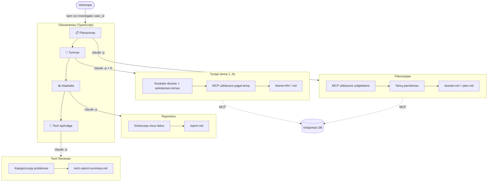

# Tyras — Lietuvos viešųjų pirkimų sukčiavimų tyrimų agentinė sistema

Daugiagentė sistema veikianti su Claude Code, skirta tirti viešųjų pirkimų sukčiavimą Lietuvoje. Agentai naudoja
[Viešpirkiai MCP](https://viespirkiai.org/mcp), kuris leidžia tyrinėti pirkimo sutartis, įmonių registrą, teismo bylas
ir PINREG deklaracijas. Ši agentinė sistema geba planuoti tyrimą, jį vykdyti bei parengti tyrimo ataskaitas su
rekomendacijomis dėl susisiekimo su priežiūros institucijoms kaip STT, FNTT, VPT, VK ir KT.

---

## Greitas startas

1. Sukurkite Claude paskyrą, eikite į Customize → Connectors → Add custom connector → ir pridėkite
   `https://viespirkiai.org/mcp`
2. Įsigykite [Claude Pro planą](https://claude.com/pricing), įdiekite
   [Claude Code](https://code.claude.com/docs/en/quickstart)
3. [Atsisiųskite šį repozitorių](https://github.com/Viespirkiu-grupe/Tyras/archive/refs/heads/main.zip) arba naudokite
   Git: `git clone https://github.com/Viespirkiu-grupe/Tyras.git`
4. Atidarykite terminalą, eikite į šio repozitoriaus šakninį aplanką `Tyras/` ir paleiskite:

```bash
npm run investigate 20260617_sveikata
```

5. Sukuriamas failas `investigations/20260617_sveikata/case.md` — atidarykite jį ir aprašykite tyrimo atvejį, pvz.:

```text
Ar gali pereiti per pagrindines institucijas, patikrinti IT paslaugų pirkimo konkursus, pasižiūrėti kas laimėjo kiekvieną etapą ir matant didesnę imtį paieškoti sąsajų.
Vienas iš rizikos veiksnių yra nedidelė techninės specifikacijos paruošimo paslaugų kaina.
Apimtis (Scope) yra sveikatos ministerija ir visos sveikatos ministerijai pavaldžias institucijas.
```

6. Paleiskite tą pačią komandą dar kartą:

```bash
npm run investigate 20260617_sveikata
```

Sistema parodys jūsų bylos aprašymą ir paprašys patvirtinimo. Po patvirtinimo prasideda tyrimas — planuotojas
išanalizuos užklausą, parinks sukčiavimo temas, tyrėjai vykdys MCP užklausas, o reporteris apibendrins išvadas į
`report.md`.

Jei tyrimas nutrūksta, tiesiog paleiskite tą pačią komandą — sistema tęs nuo kur sustojo.

> Paprastai vienas tyrimas trunka apie 30 minučių ir sunaudoja trečdalį sesijos žetonų.

---

## Komandos

```bash
npm run investigate 20260617_kelme   # pirmu paleidimu sukuriamas case.md; galima pleisti dar karta, tada bus pratęsiama nuo kur sustojo
npm run format                       # dokumentų formatavimas, kad atrodytų tvarkingai
```

---

## Kaip veikia

Tyras yra TypeScript orkestrantas, kuris paleidžia `claude -p` subprocesus kiekvienam tyrimo etapui. Kiekvienas agentas
veikia kaip nepriklausoma Claude sesija su ribotais įrankiais (Read, Write, Edit + MCP). Agentai vienas kito
nekviečia — orkestrantas valdo visą grandinę.



### Etapai

| # | Etapas        | Agentas       | Kas vyksta                                                   | Rezultatas               |
|---|---------------|---------------|--------------------------------------------------------------|--------------------------|
| 1 | Planavimas    | Planuotojas   | Analizuoja bylą, klausinėja MCP visų subjektų, parenka temas | `dossier.md`, `plan.md`  |
| 2 | Tyrimas       | Tyrėjai × N   | Kiekvienas vykdo vieną temą — MCP užklausos, išvadų rašymas  | `theme-NN-*.md`          |
| 3 | Ataskaita     | Reporteris    | Sintezuoja visas išvadas, nustato tarptemines sąsajas        | `report.md`              |
| 4 | Tech apžvalga | Tech Reviewer | Kategorizuoja MCP ir sistemos problemas                      | `tech-report-summary.md` |

### Pagrindiniai dizaino sprendimai

- Kiekvienas agentas = vienas `claude -p` subprocesas su `--tools "Read,Write,Edit"` (be Agent, be Bash)
- MCP įrankiai pasiekiami natūraliai per projekto `.claude` konfigūraciją
- `--max-budget-usd` riboja kainą kiekvienam etapui
- Būsena saugoma `investigation-state.json` po kiekvieno žingsnio — pertrūkus, tęsia nuo kur sustojo
- Temos gali būti vykdomos lygiagrečiai (`PARALLEL=true`)
- Nulis runtime priklausomybių — naudoja tik `claude` CLI

### Aplinkos kintamieji

| Kintamasis            | Numatytoji reikšmė | Paskirtis                        |
|-----------------------|--------------------|----------------------------------|
| `MODEL`               | `sonnet`           | Claude modelio alias             |
| `MAX_RETRIES`         | `3`                | Maks. bandymų skaičius per etapą |
| `MAX_BUDGET_PER_STEP` | `5.0`              | Maks. USD per etapą              |
| `PARALLEL`            | `false`            | Lygiagretus temų vykdymas        |

---

## Tyrimo darbo katalogas

Kiekviena byla saugoma aplanke `investigations/<case-id>/` (formatas: `YYYYMMDD_keyword`):

| Failas                     | Parašo                              | Paskirtis                                                  |
|----------------------------|-------------------------------------|------------------------------------------------------------|
| `case.md`                  | Vartotojas                          | Bylos aprašymas                                            |
| `dossier.md`               | Planuotojas                         | Bendri subjektų duomenys; visi agentai nuskaito            |
| `plan.md`                  | Planuotojas                         | Parinktos temos ir temų užklausų planai                    |
| `theme-NN-<name>.md`       | Tyrėjas (po vieną kiekvienai temai) | Temų išvados ir neapdoroti MCP duomenys                    |
| `report.md`                | Reporteris                          | Galutinė ataskaita su rekomendacijomis                     |
| `tech-report.md`           | Visi agentai                        | MCP įrankių klaidos ir duomenų spragos (grįžtamasis ryšys) |
| `tech-report-summary.md`   | Tech reviewer                       | Kategorizuotos techninės problemos                         |
| `investigation.log`        | Orkestrantas                        | Pilnas orkestratoriaus žurnalas su laiko žymėmis           |
| `investigation-state.json` | Orkestrantas                        | Orchestracijos būsena (tęsimui)                            |

---

## Šaltinio kodas

```
src/
  index.ts                ← CLI įėjimo taškas
  help.ts                 ← CLI pagalbos tekstas
  orchestrator.ts         ← pipeline: planuotojas → tyrėjai → reporteris → tech reviewer
  agent-loop.ts           ← claude -p subprocesų valdymas (stream-json)
  config.ts               ← aplinkos kintamųjų konfigūracija
  types.ts                ← bendri tipai
  agents/planner.ts       ← planuotojo agento funkcija
  agents/investigator.ts  ← tyrėjo agento funkcija
  agents/reporter.ts      ← reporterio agento funkcija
  agents/tech-reviewer.ts ← tech report kategorizatorius
  prompts/*.md            ← sistemos instrukcijos (pridedamos prie Claude Code numatytųjų)
  io/workspace.ts         ← failų valdymo pagalbinės funkcijos
  io/loader.ts            ← prompt failų skaitytuvas
  io/logger.ts            ← dvigubas konsolė + failas loggeris
```

---

## Temų biblioteka

28 sukčiavimo aptikimo temos aplanke `docs/themes/`. Rodyklė ir MCP įrankių taisyklės:
`docs/index/mcp-investigator-prompt.md`.

| #  | Tema                                                                               | Pagrindiniai subjektai               |
|----|------------------------------------------------------------------------------------|--------------------------------------|
| 1  | Fiktyvios įmonės / pajėgumų neatitikimas                                           | įmonė, sutartis                      |
| 2  | Pasiūlymų suokalbis / fiktyvūs konkurentai                                         | įmonė, konkursas                     |
| 3  | Pasiūlymų rotacijos karuselė                                                       | įmonė, konkursas                     |
| 4  | Interesų konfliktas — bendri asmenys tarp pirkėjo ir pardavėjo                     | asmuo, įmonė                         |
| 5  | Sutarčių skaidymas siekiant išvengti ribų                                          | sutartis, konkursas                  |
| 6  | Geografinė monopolija / vietinis užvaldymas                                        | įmonė, sutartis, pirkėjas            |
| 7  | Procedūros manipuliavimas / nepagrįstas tiesioginis skyrimas                       | konkursas, sutartis, pirkėjas        |
| 8  | Kainų anomalijos / permokėjimas / apimties plėtimas                                | sutartis                             |
| 9  | Atitikties ir juodųjų sąrašų patikrinimas                                          | įmonė, asmuo, byla                   |
| 10 | Tinklas — antros eilės ryšiai ir korporatyviniai tinklai                           | įmonė, asmuo                         |
| 11 | UBO rizika — tikrasis savininkas per valdymo struktūrų sluoksnius                  | įmonė, asmuo                         |
| 12 | ES struktūrinių fondų piktnaudžiavimas / fiktyvūs subrangovai                      | įmonė, sutartis                      |
| 13 | Besisukančių durų efektas — pirkimų pareigūnas pereina pas laimėjusį tiekėją       | asmuo                                |
| 14 | Specifikacijų suokalbis — techninės spec. rašomos vienam tiekėjui                  | įmonė, konkursas, pirkėjas           |
| 15 | Pagrindų sutarties piktnaudžiavimas / vieno tiekėjo atšaukimai                     | įmonė, sutartis, pirkėjas            |
| 16 | Bendras administracinis aparatas — konkuruojančios įmonės vienu adresu ar domenu   | įmonė                                |
| 17 | Kainų kartelis — įtartinai vienodos pasiūlymų kainos                               | įmonė, konkursas                     |
| 18 | Sutarties pakeitimų eskalacija — maža pasiūlymo kaina didinama pakeitimais         | sutartis, pirkėjas                   |
| 19 | Savivaldybės įmonių favoritizmas — pirkėjas skiria sutartis savo dukterinei įmonei | įmonė, sutartis, pirkėjas            |
| 20 | Riboto konkurso manipuliavimas — pirkėjas pats pasirenka kviečiamuosius            | konkursas, pirkėjas                  |
| 21 | Politinių ryšių favoritizmas — įmonės susietos su partijų rėmėjais                 | asmuo, įmonė                         |
| 22 | Fiktyvūs pristatymų aktai — sutartis pažymėta kaip įvykdyta, bet darbai neatlikti  | sutartis, byla                       |
| 23 | Tiekėjo įkalinimas / esamo tiekėjo struktūrinė monopolija                          | įmonė, sutartis                      |
| 24 | ES fondų pažeidimai ir tarpvalstybiniai sukčiavimo modeliai                        | įmonė, sutartis, byla                |
| 25 | Pinigų plovimo požymiai pirkimų srautuose                                          | įmonė, asmuo, byla                   |
| 26 | Sisteminiai vidinės kontrolės silpnumai pirkėjuose                                 | pirkėjas                             |
| 27 | Sektoriui būdingi rizikos požymiai (sveikatos apsauga, statyba, IT)                | įmonė, sutartis, konkursas, pirkėjas |
| 28 | Vieno dalyvio pirkimai — pagrindinis konkurencijos intensyvumo rodiklis            | konkursas, pirkėjas, įmonė           |
