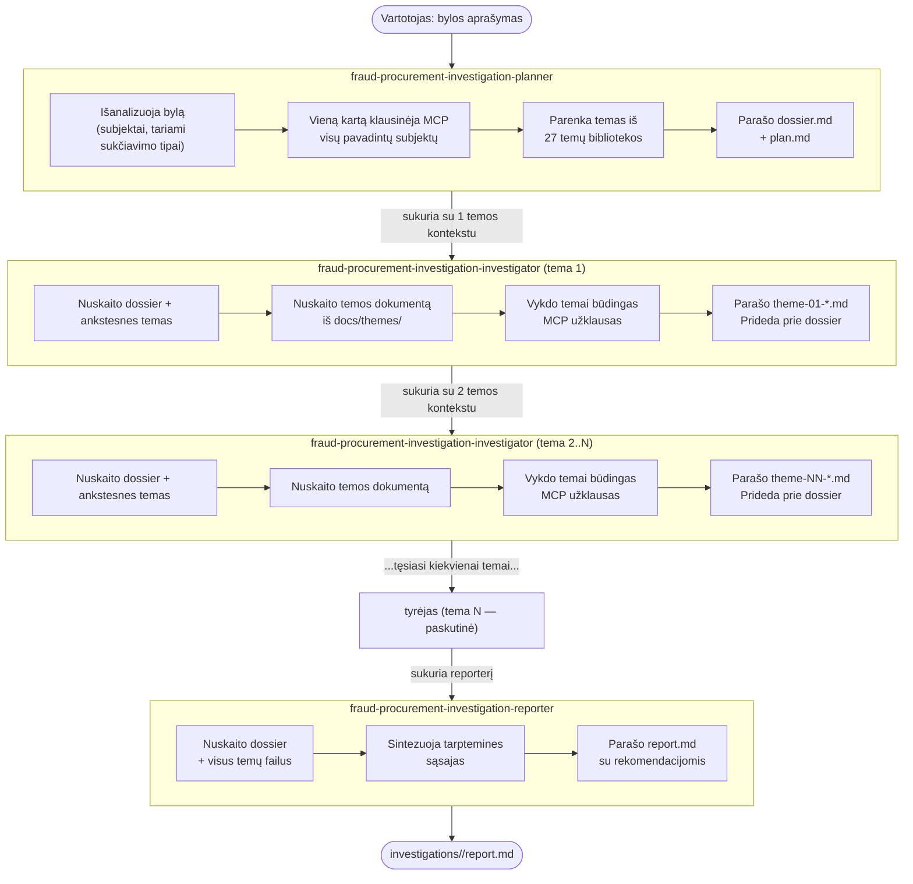

# Tyras — Lietuvos viešųjų pirkimų sukčiavimų tyrimų agentinė sistema

Daugiagentė sistema veikianti su Claude Code, skirta tirti viešųjų pirkimų sukčiavimą Lietuvoje. Agentai naudoja
[Viešpirkiai MCP](https://viespirkiai.org/mcp), kuris leidžia tyrinėti pirkimo sutartis, įmonių registrą, teismo bylas
ir PINREG deklaracijas. Ši agentinė sistema geba planuoti tyrimą, jį vykdyti bei parengti tyrimo ataskaitas su
rekomendacijomis dėl susisiekimo su priežiūros institucijoms kaip STT, FNTT, VPT, VK ir KT.

---

## Greitas startas

1. Sukurkite Claude paskyrą, eikite į Customize → Connectors → Add custom connector → ir pridėkite
   `https://viespirkiai.org/mcp`
2. Įsigykite [Claude Pro planą](https://claude.com/pricing), įdiekite [Claude Code](https://code.claude.com/docs/en/quickstart)
3. [Atsisiųskite šį repozitorių](https://github.com/Viespirkiu-grupe/Tyras/archive/refs/heads/main.zip) arba naudokite
   Git: `git clone https://github.com/Viespirkiu-grupe/Tyras.git`
4. Atidarykite terminalą, eikite į šio repozitoriaus šakninį aplanką `Tyras/` ir paleiskite `claude` komandą.
5. Įveskite `/mcp` ir patikrinkite, ar [Viešpirkiai MCP serveris](https://viespirkiai.org/mcp) pasiekiamas.
6. Įveskite `/agents` ir pasirinkite Library → `fraud-procurement-investigation-planner`.
7. Įrašykite pradinę tyrimo užklausą, pvz.:

```text
Ar gali pereiti per pagrindines institucijas, patikrinti IT paslaugų pirkimo konkursus, pasižiūrėti kas laimėjo kiekvieną etapą ir matant didesnę imtį paieškoti sąsajų.
Vienas iš rizikos veiksnių yra nedidelė techninės specifikacijos paruošimo paslaugų kaina.
Apimtis (Scope) yra sveikatos ministerija ir visos sveikatos ministerijai pavaldžias institucijas.
```

Daugiau nieko daryti nereikia — tiesiog stebėkite, kaip dirba agentai! Planuotojas išanalizuos jūsų užklausą, parinks
tinkamas sukčiavimo temas ir sukurs tyrėjų agentus MCP užklausoms vykdyti. Galiausiai reporterio agentas apibendrins
išvadas į struktūrizuotą ataskaitą su rekomendacijomis. `report.md` rasite aplanke `investigations/`.

> Paprastai vienas tyrimas trunka apie 30 minučių ir sunaudoja trečdalį sesijos žetonų.

---

## Agentų apžvalga

### `fraud-procurement-investigation-planner`

Inicijuoja tyrimą pagal bylos aprašymą. Išanalizuoja bylą, vieną kartą klausinėja MCP visų pavadintų subjektų (įmonių ir
asmenų), iš 27 temų bibliotekos parenka aktualias sukčiavimo temas, tada parašo bendrą dossier ir tyrimo planą. Sukuria
pirmąjį tyrėjo agentą temų grandinei pradėti.

**Paleidimas:** Vartotojas aprašo tyrimo tikslą — pvz. _„Ar gali pereiti per pagrindines institucijas, patikrinti IT
paslaugų
pirkimo konkursus..."_

---

### `fraud-procurement-investigation-investigator`

Kiekviena instancija vykdo vieną sukčiavimo temą. Nuskaito bendrą dossier ir visas ankstesnes temų išvadas, tada vykdo
temai būdingas MCP užklausas (agregacijas, dokumentų paieškas, SQL per pirkimų rodinius). Parašo savo išvadų failą,
prideda santrauką prie dossier ir sukuria kitą tyrėją arba reporterį, jei tai paskutinė tema.

**Visada sukuriamas planuotojo arba ankstesnio tyrėjo. Tiesiogiai nepaleidžiamas.**

---

### `fraud-procurement-investigation-reporter`

Sintezės agentas MCP užklausų nevykdo. Nuskaito dossier ir visus temų išvadų failus, nustato tarptemines sąsajas ir
parašo galutinę tyrimo ataskaitą. Apima įrodymų inventorių, subjektų santrauką ir parengtą skyrių su rekomendacijomis
dėl kontaktavimo su priežiūros institucijoms (STT / FNTT / VPT / VK / KT).

**Visada sukuriamas paskutinio tyrėjo agento. Tiesiogiai nepaleidžiamas.**

---

## Agentų darbo eiga



---

## Tyrimo darbo katalogas

Kiekviena byla saugoma aplanke `investigations/<case-id>/` (formatas: `inv-YYYY-NNN`):

| Failas               | Parašo                              | Paskirtis                                                  |
|----------------------|-------------------------------------|------------------------------------------------------------|
| `dossier.md`         | Planuotojas                         | Bendri subjektų duomenys; visi agentai nuskaito            |
| `plan.md`            | Planuotojas                         | Parinktos temos ir temų užklausų planai                    |
| `theme-NN-<name>.md` | Tyrėjas (po vieną kiekvienai temai) | Temų išvados ir neapdoroti MCP duomenys                    |
| `report.md`          | Reporteris                          | Galutinė ataskaita su rekomendacijomis                     |
| `TOBULINTI.md`       | Visi agentai                        | MCP įrankių klaidos ir duomenų spragos (grįžtamasis ryšys) |

---

## Temų biblioteka

27 sukčiavimo aptikimo temos aplanke `docs/themes/`. Rodyklė ir MCP įrankių taisyklės:
`docs/index/mcp-investigator-prompt.md`.

| #  | Tema                                                                               | Pagrindiniai subjektai               |
|----|------------------------------------------------------------------------------------|--------------------------------------|
| 1  | Fiktyvios įmonės / pajėgumų neatitikimas                                           | įmonė, sutartis                      |
| 2  | Pasiūlymų suokalbis / fiktyvūs konkurentai                                         | įmonė, konkursas                     |
| 3  | Pasiūlymų rotacijos karuselė                                                       | įmonė, konkursas                     |
| 4  | Interesų konfliktas — bendri asmenys tarp pirkėjo ir pardavėjo                     | asmuo, įmonė                         |
| 5  | Sutarčių skaidymas siekiant išvengti ribų                                          | sutartis, konkursas                  |
| 6  | Geografinė monopolija / vietinis užvaldymas                                        | įmonė, sutartis, pirkėjas            |
| 7  | Procedūros manipuliavimas / nepagrįstas tiesioginis skyrimas                       | konkursas, sutartis, pirkėjas        |
| 8  | Kainų anomalijos / permokėjimas / apimties plėtimas                                | sutartis                             |
| 9  | Atitikties ir juodųjų sąrašų patikrinimas                                          | įmonė, asmuo, byla                   |
| 10 | Tinklas — antros eilės ryšiai ir korporatyviniai tinklai                           | įmonė, asmuo                         |
| 11 | UBO rizika — tikrasis savininkas per valdymo struktūrų sluoksnius                  | įmonė, asmuo                         |
| 12 | ES struktūrinių fondų piktnaudžiavimas / fiktyvūs subrangovai                      | įmonė, sutartis                      |
| 13 | Besisukančių durų efektas — pirkimų pareigūnas pereina pas laimėjusį tiekėją       | asmuo                                |
| 14 | Specifikacijų suokalbis — techninės spec. rašomos vienam tiekėjui                  | įmonė, konkursas, pirkėjas           |
| 15 | Pagrindų sutarties piktnaudžiavimas / vieno tiekėjo atšaukimai                     | įmonė, sutartis, pirkėjas            |
| 16 | Bendras administracinis aparatas — konkuruojančios įmonės vienu adresu ar domenu   | įmonė                                |
| 17 | Kainų kartelis — įtartinai vienodos pasiūlymų kainos                               | įmonė, konkursas                     |
| 18 | Sutarties pakeitimų eskalacija — maža pasiūlymo kaina didinama pakeitimais         | sutartis, pirkėjas                   |
| 19 | Savivaldybės įmonių favoritizmas — pirkėjas skiria sutartis savo dukterinei įmonei | įmonė, sutartis, pirkėjas            |
| 20 | Riboto konkurso manipuliavimas — pirkėjas pats pasirenka kviečiamuosius            | konkursas, pirkėjas                  |
| 21 | Politinių ryšių favoritizmas — įmonės susietos su partijų rėmėjais                 | asmuo, įmonė                         |
| 22 | Fiktyvūs pristatymų aktai — sutartis pažymėta kaip įvykdyta, bet darbai neatlikti  | sutartis, byla                       |
| 23 | Tiekėjo įkalinimas / esamo tiekėjo struktūrinė monopolija                          | įmonė, sutartis                      |
| 24 | ES fondų pažeidimai ir tarpvalstybiniai sukčiavimo modeliai                        | įmonė, sutartis, byla                |
| 25 | Pinigų plovimo požymiai pirkimų srautuose                                          | įmonė, asmuo, byla                   |
| 26 | Sisteminiai vidinės kontrolės silpnumai pirkėjuose                                 | pirkėjas                             |
| 27 | Sektoriui būdingi rizikos požymiai (sveikatos apsauga, statyba, IT)                | įmonė, sutartis, konkursas, pirkėjas |
